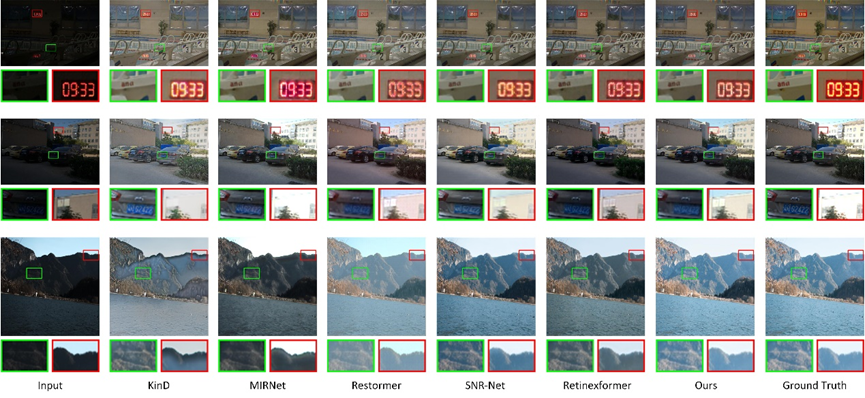
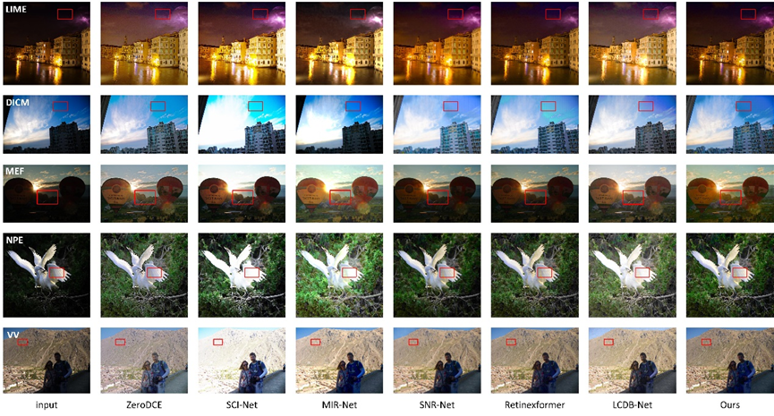

# LIPResNet

Learnable Illumination Prior based  Residual Network for  Low-light Image Enhancement in Stages

---------------------


## Abstract

The core goal of low-light image enhancement is to improve brightness, contrast, and color fidelity, addressing issues such as blurred details and color distortion commonly encountered in low-light environments. Although existing methods have made progress in improving brightness and enhancing details, they are often accompanied by color distortion and increased noise. To address these issues, this paper proposes a Learnable Illumination Prior based  Residual Network (LIPResNet), inspired by the residual network's ability to learn the difference between the input and output. The network aims to gradually enhance the brightness and detail of low-light images by learning the difference between low-light and normal-light images in two stages, ultimately producing improved low-light images. To address the issue of insufficient image brightness, this paper proposes a learnable illumination prior module that can accurately estimate illumination information and effectively compensate for it. Additionally, to ensure a more comprehensive fusion of illumination and detail information, this paper proposes an illumination-guided convolutional attention module that enables effective integration of both types of information. Experimental results on 15 datasets, including LOL, LSRW, and FiveK, demonstrate that LIPResNet effectively reduces noise and color distortion while enhancing image quality. Moreover, it outperforms most current mainstream methods across the majority of datasets.


## Result

- Our results on the reference dataset can be downloaded from [Baidu Cloud](https://pan.baidu.com/s/1PIffsfYLCAC6jQqSk1f4Ig?pwd=yIPR 
)(code:yIPR) or[ Google Cloud](https://drive.google.com/drive/folders/1eIgScOhgWfjtNaGzUC91PKnTmSmH4QFF?usp=drive_link).

- Our results on the no-reference dataset can be downloaded from [Baidu Cloud](https://pan.baidu.com/s/1Ag69l60L-EqYSyZaHs8D9g?pwd=yIPR)(code:yIPR) or [Google Cloud](https://drive.google.com/drive/folders/1BknyJgJ_pudp04eMsaw2XQS2qo5aOVcl?usp=drive_link).

<details close>
<summary><b>Performance on datasets such as LOL and SMID</b></summary>


</details>

<details close>
<summary><b>Visual results on the LOL dataset</b></summary>



</details>

<details close>
<summary><b>Visual performance on LIME, DICM, MEF, NPE, and VV datasets</b></summary>



</details>

## 1. Create Environment

- Make Conda Environment

```shell
conda create -n LIPResNet python=3.7 -y
conda activate LIPResNet
```

- Install Dependencies

```shell
conda install pytorch=1.11 torchvision cudatoolkit=11.3 -c pytorch

pip install matplotlib scikit-learn scikit-image opencv-python yacs joblib natsort h5py tqdm tensorboard 

pip install einops gdown addict future lmdb numpy pyyaml requests scipy yapf lpips 
```

- Install BasicSR

```shell
python setup.py develop --no_cuda_ext
```

## 2. Prepare Dataset

Download the following datasets:

LOL-v1 [Baidu Disk](https://pan.baidu.com/s/1ZAC9TWR-YeuLIkWs3L7z4g?pwd=cyh2) (code: `cyh2`), [Google Drive](https://drive.google.com/file/d/1L-kqSQyrmMueBh_ziWoPFhfsAh50h20H/view?usp=sharing)

LOL-v2 [Baidu Disk](https://pan.baidu.com/s/1X4HykuVL_1WyB3LWJJhBQg?pwd=cyh2) (code: `cyh2`), [Google Drive](https://drive.google.com/file/d/1Ou9EljYZW8o5dbDCf9R34FS8Pd8kEp2U/view?usp=sharing)

SMID [Baidu Disk](https://pan.baidu.com/share/init?surl=Qol_4GsIjGDR8UT9IRZbBQ) (code: `btux`), [Google Drive](https://drive.google.com/drive/folders/1OV4XgVhipsRqjbp8SYr-4Rpk3mPwvdvG)

MIT-Adobe FiveK [Baidu Disk](https://pan.baidu.com/s/1ajax7N9JmttTwY84-8URxA?pwd=cyh2) (code:`cyh2`), [Google Drive](https://drive.google.com/file/d/11HEUmchFXyepI4v3dhjnDnmhW_DgwfRR/view?usp=sharing), [Official](https://data.csail.mit.edu/graphics/fivek/)

LSRW [Baidu Disk](https://pan.baidu.com/s/1XHWQAS0ZNrnCyZ-bq7MKvA) (code:`wmrr`)

SID [Baidu Disk](https://pan.baidu.com/share/init?surl=HRr-5LJO0V0CWqtoctQp9w) (code:`gplv`), [Google Drive](https://drive.google.com/drive/folders/1eQ-5Z303sbASEvsgCBSDbhijzLTWQJtR)

SDSD-indoor [Baidu Disk](https://pan.baidu.com/share/init?surl=rfRzshGNcL0MX5soRNuwTA#list/path=%2F) (code:`jo1v`), [Google Drive](https://drive.google.com/drive/folders/14TF0f9YQwZEntry06M93AMd70WH00Mg6)

SDSD-outdoor [Baidu Disk](https://pan.baidu.com/share/init?surl=JzDQnFov-u6aBPPgjSzSxQ) (code:`uibk`), [Google Drive](https://drive.google.com/drive/folders/14TF0f9YQwZEntry06M93AMd70WH00Mg6)  

**Note:** 
(1) Please use [bandizip](https://www.bandisoft.com/bandizip/) to jointly unzip the `.zip` and `.z01` files of SMID

(2) Please download the `text_list.txt` from [Google Drive](https://drive.google.com/file/d/199qrfizUeZfgq3qVjrM74mZ_nlacgwiP/view?usp=sharing) or [Baidu Disk](https://pan.baidu.com/s/1GQfaQLI6tvB0IrTMPOM_9Q?pwd=ggbh) (code: `ggbh`) and then put it into the folder `data/SMID/`

<details close>
<summary><b> Then organize these datasets as follows: </b></summary>

```
    |--data   
    |    |--LOLv1
    |    |    |--Train
    |    |    |    |--input
    |    |    |    |    |--100.png
    |    |    |    |    |--101.png
    |    |    |    |     ...
    |    |    |    |--target
    |    |    |    |    |--100.png
    |    |    |    |    |--101.png
    |    |    |    |     ...
    |    |    |--Test
    |    |    |    |--input
    |    |    |    |    |--111.png
    |    |    |    |    |--146.png
    |    |    |    |     ...
    |    |    |    |--target
    |    |    |    |    |--111.png
    |    |    |    |    |--146.png
    |    |    |    |     ...
    |    |--LOLv2
    |    |    |--Real_captured
    |    |    |    |--Train
    |    |    |    |    |--Low
    |    |    |    |    |    |--00001.png
    |    |    |    |    |    |--00002.png
    |    |    |    |    |     ...
    |    |    |    |    |--Normal
    |    |    |    |    |    |--00001.png
    |    |    |    |    |    |--00002.png
    |    |    |    |    |     ...
    |    |    |    |--Test
    |    |    |    |    |--Low
    |    |    |    |    |    |--00690.png
    |    |    |    |    |    |--00691.png
    |    |    |    |    |     ...
    |    |    |    |    |--Normal
    |    |    |    |    |    |--00690.png
    |    |    |    |    |    |--00691.png
    |    |    |    |    |     ...
    |    |    |--Synthetic
    |    |    |    |--Train
    |    |    |    |    |--Low
    |    |    |    |    |   |--r000da54ft.png
    |    |    |    |    |   |--r02e1abe2t.png
    |    |    |    |    |    ...
    |    |    |    |    |--Normal
    |    |    |    |    |   |--r000da54ft.png
    |    |    |    |    |   |--r02e1abe2t.png
    |    |    |    |    |    ...
    |    |    |    |--Test
    |    |    |    |    |--Low
    |    |    |    |    |   |--r00816405t.png
    |    |    |    |    |   |--r02189767t.png
    |    |    |    |    |    ...
    |    |    |    |    |--Normal
    |    |    |    |    |   |--r00816405t.png
    |    |    |    |    |   |--r02189767t.png
    |    |    |    |    |    ...
    |    |--SMID
    |    |    |--SMID_LQ_np
    |    |    |    |--0001
    |    |    |    |    |--0001.npy
    |    |    |    |    |--0002.npy
    |    |    |    |     ...
    |    |    |    |--0002
    |    |    |    |    |--0001.npy
    |    |    |    |    |--0002.npy
    |    |    |    |     ...
    |    |    |     ...
    |    |    |--SMID_Long_np
    |    |    |    |--0001
    |    |    |    |    |--0001.npy
    |    |    |    |    |--0002.npy
    |    |    |    |     ...
    |    |    |    |--0002
    |    |    |    |    |--0001.npy
    |    |    |    |    |--0002.npy
    |    |    |    |     ...
    |    |    |--text_list.txt
    |    |--FiveK
    |    |    |--train
    |    |    |    |--input
    |    |    |    |    |--a0099-kme_264.jpg
    |    |    |    |    |--a0101-kme_610.jpg
    |    |    |    |     ...
    |    |    |    |--target
    |    |    |    |    |--a0099-kme_264.jpg
    |    |    |    |    |--a0101-kme_610.jpg
    |    |    |    |     ...
    |    |    |--test
    |    |    |    |--input
    |    |    |    |    |--a4574-DSC_0038.jpg
    |    |    |    |    |--a4576-DSC_0217.jpg
    |    |    |    |     ...
    |    |    |    |--target
    |    |    |    |    |--a4574-DSC_0038.jpg
    |    |    |    |    |--a4576-DSC_0217.jpg
    |    |    |    |     ...
    |    |--LSRW
    |    |    |--Huawei
    |    |    |    |--Train
    |    |    |    |    |--low
    |    |    |    |    |    |--00001.jpg
    |    |    |    |    |    |--00002.jpg
    |    |    |    |    |     ...
    |    |    |    |    |--high
    |    |    |    |    |    |--00001.jpg
    |    |    |    |    |    |--00002.jpg
    |    |    |    |    |     ...
    |    |    |    |--Test
    |    |    |    |    |--low
    |    |    |    |    |    |--2037.jpg
    |    |    |    |    |    |--2038.jpg
    |    |    |    |    |     ...
    |    |    |    |    |--high
    |    |    |    |    |    |--2037.jpg
    |    |    |    |    |    |--2038.jpg
    |    |    |    |    |     ...
    |    |    |--Nikon
    |    |    |    |--Train
    |    |    |    |    |--low
    |    |    |    |    |   |--1.jpg
    |    |    |    |    |   |--2.jpg
    |    |    |    |    |    ...
    |    |    |    |    |--high
    |    |    |    |    |   |--1.jpg
    |    |    |    |    |   |--2.jpg
    |    |    |    |    |    ...
    |    |    |    |--Test
    |    |    |    |    |--low
    |    |    |    |    |   |--3001.jpg
    |    |    |    |    |   |--3002.jpg
    |    |    |    |    |    ...
    |    |    |    |    |--high
    |    |    |    |    |   |--3001.jpg
    |    |    |    |    |   |--3002.jpg
    |    |    |    |    |    ...
    |    |--SID
    |    |    |--long_sid2
    |    |    |    |--00001
    |    |    |    |    |--00001_00_10s.npy
    |    |    |    |--00002
    |    |    |    |    |--00002_00_10s.npy
    |    |    |    ... 
    |    |    |--short_sid2
    |    |    |    |--00001
    |    |    |    |    |--00001_00_0.1s.npy
    |    |    |    |    |--00001_00_0.04s.npy
    |    |    |    |    |    ...        
    |    |    |    |--00002
    |    |    |    |    |--00002_00_0.1s.npy
    |    |    |    |    |--00002_00_0.04s.npy
    |    |    |    |    |    ...        
    |    |    |    ... 
    |    |--SDSD
    |    |    |--indoor_static_np
    |    |    |    |--input
    |    |    |    |    |--pair1
    |    |    |    |    |   |--0001.npy
    |    |    |    |    |   |--0002.npy
    |    |    |    |    |    ...
    |    |    |    |    |--pair2
    |    |    |    |    |   |--0001.npy
    |    |    |    |    |   |--0002.npy
    |    |    |    |    |    ...
    |    |    |    |     ...
    |    |    |    |--GT
    |    |    |    |    |--pair1
    |    |    |    |    |   |--0001.npy
    |    |    |    |    |   |--0002.npy
    |    |    |    |    |    ...
    |    |    |    |    |--pair2
    |    |    |    |    |   |--0001.npy
    |    |    |    |    |   |--0002.npy
    |    |    |    |    |    ...
    |    |    |    |     ...
    |    |    |--outdoor_static_np
    |    |    |    |--input
    |    |    |    |    |--MVI_0898
    |    |    |    |    |   |--0001.npy
    |    |    |    |    |   |--0002.npy
    |    |    |    |    |    ...
    |    |    |    |    |--MVI_0918
    |    |    |    |    |   |--0001.npy
    |    |    |    |    |   |--0002.npy
    |    |    |    |    |    ...
    |    |    |    |     ...
    |    |    |    |--GT
    |    |    |    |    |--MVI_0898
    |    |    |    |    |   |--0001.npy
    |    |    |    |    |   |--0002.npy
    |    |    |    |    |    ...
    |    |    |    |    |--MVI_0918
    |    |    |    |    |   |--0001.npy
    |    |    |    |    |   |--0002.npy
    |    |    |    |    |    ...
    |    |    |    |     ...   

    

```

</details>


We also provide download links for LIME, NPE, MEF, DICM, and VV datasets that have no ground truth:

[Baidu Disk](https://pan.baidu.com/s/1IPHseGVdWgUMeJMWCE6Flg?pwd=yIPR) (code: `yIPR`)
 or [Google Drive](https://drive.google.com/drive/folders/141Do9QmDPY3aqvZ2gG8LUanMu20W1aeR?usp=drive_link)

## 3. Testing

```shell
# activate the environment
conda activate LIPResNet

# LOL-v1
python Enhancement/test_from_dataset.py --opt Options/LOL_v1.yml --weights pretrained_weights/LOL_v1.pth --dataset LOL_v1

# LOL-v2-real
python Enhancement/test_from_dataset.py --opt Options/LOL_v2_real.yml --weights pretrained_weights/LOL_v2_real.pth --dataset LOL_v2_real

# LOL-v2-synthetic
python Enhancement/test_from_dataset.py --opt Options/LOL_v2_synthetic.yml --weights pretrained_weights/LOL_v2_synthetic.pth --dataset LOL_v2_synthetic

# SMID
python Enhancement/test_from_dataset.py --opt Options/SMID.yml --weights pretrained_weights/SMID.pth --dataset SMID

# FiveK
python Enhancement/test_from_dataset.py --opt Options/FiveK.yml --weights pretrained_weights/FiveK.pth --dataset FiveK

# LSRW-huawei
python Enhancement/test_from_dataset.py --opt Options/LSRW_Huawei.yml --weights pretrained_weights/LSRW_Huawei.pth --dataset LSRW_Huawei

# LSRW-Nikon
python Enhancement/test_from_dataset.py --opt Options/LSRW_Nikon.yml --weights pretrained_weights/LSRW_Nikon.pth --dataset LSRW_Nikon

# SID
python Enhancement/test_from_dataset.py --opt Options/SID.yml --weights pretrained_weights/SID.pth --dataset SID

# SDSD-indoor
python Enhancement/test_from_dataset.py --opt Options/SDSD_indoor.yml --weights pretrained_weights/SDSD_indoor.pth --dataset SDSD_indoor

# SDSD-outdoor
python Enhancement/test_from_dataset.py --opt Options/SDSD_outdoor.yml --weights pretrained_weights/SDSD_outdoor.pth --dataset SDSD_outdoor
```

## 4. Acknowledgments

We thank the following article and the authors for their open-source codes.

```shell
@inproceedings{Retinexformer,
  title={Retinexformer: One-stage Retinex-based Transformer for Low-light Image Enhancement},
  author={Yuanhao Cai and Hao Bian and Jing Lin and Haoqian Wang and Radu Timofte and Yulun Zhang},
  booktitle={ICCV},
  year={2023}
}

@article{huang2024channel,
  title={Channel prior convolutional attention for medical image segmentation},
  author={Huang, Hejun and Chen, Zuguo and Zou, Ying and Lu, Ming and Chen, Chaoyang and Song, Youzhi and Zhang, Hongqiang and Yan, Feng},
  journal={Computers in Biology and Medicine},
  volume={178},
  pages={108784},
  year={2024},
  publisher={Elsevier}
}
```

This repo is based on [Retinexformer](https://github.com/caiyuanhao1998/retinexformer) (ICCV 2023).